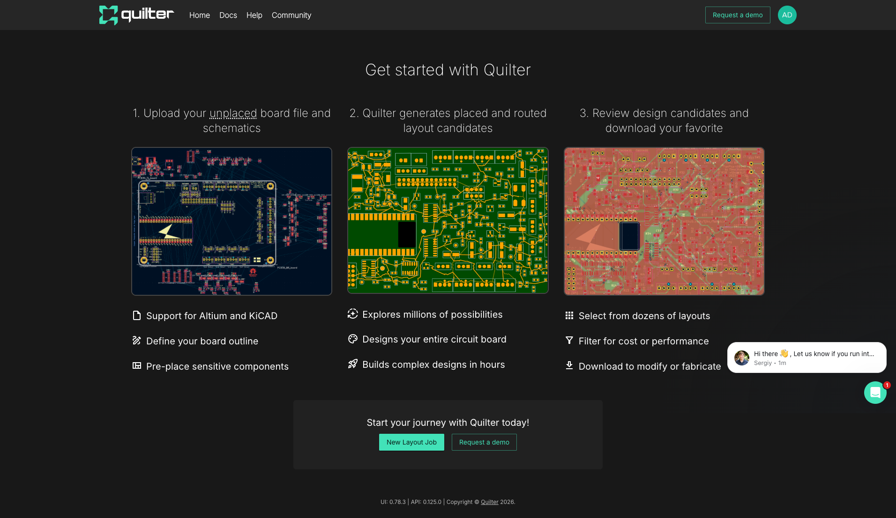
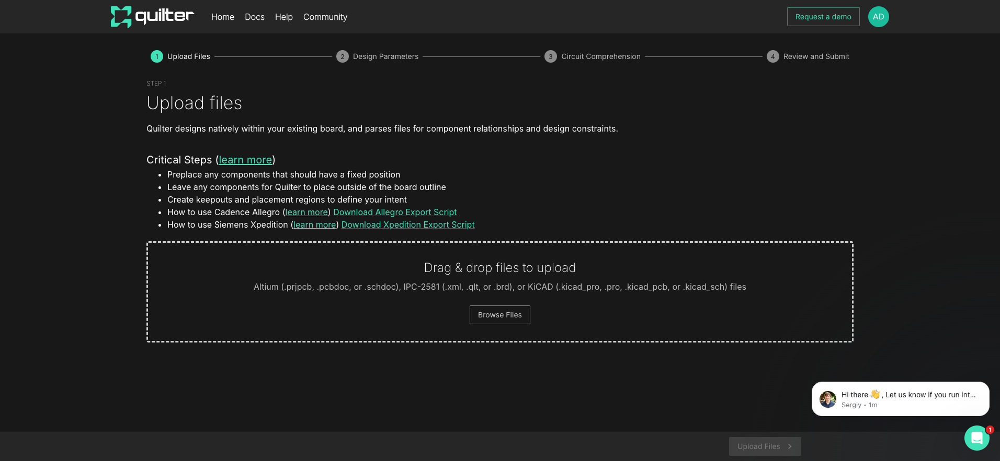
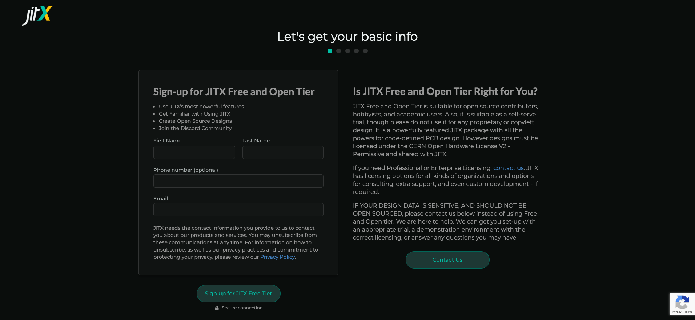
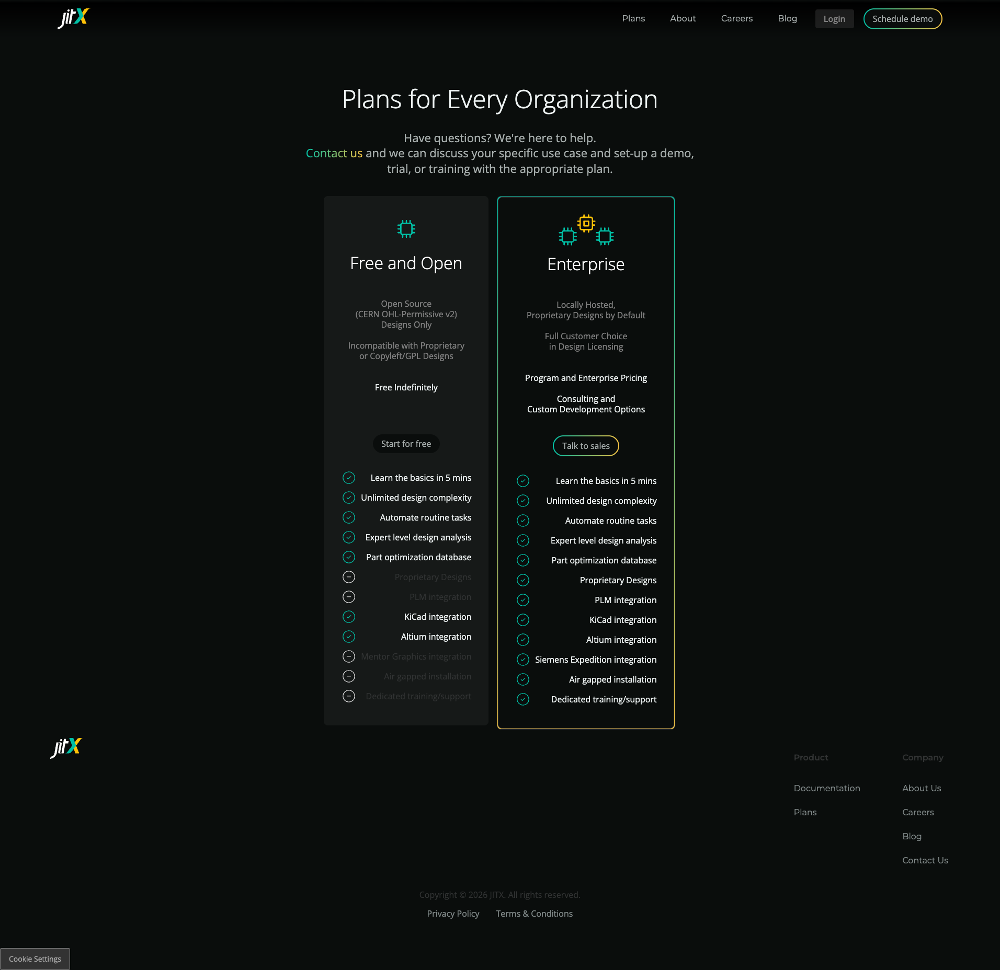

# AI PCB Design Tool Comparison: Quilter vs JITX

*A hands-on evaluation for engineers exploring AI-assisted hardware design*

**Published:** February 25, 2026  
**Author:** Adrian (DesignCon 2026 Notes)  
**Tags:** #EDA #AI #PCB #DesignAutomation #TI

---

## Executive Summary

The PCB design world is experiencing a paradigm shift with AI-powered tools promising to automate layout, reduce iteration cycles, and encode engineering expertise. I tested two leading contenders—**Quilter** and **JITX**—to understand which fits different engineering workflows.

**Bottom Line:**
- **Quilter** = AI-powered layout assistant that takes your existing designs and automates placement/routing
- **JITX** = Software-defined electronics platform where you write code that generates designs

| Aspect | Quilter | JITX |
|--------|---------|------|
| Input | KiCAD/Altium files | Python-like code (Stanza) |
| Paradigm | AI layout tool | Code-as-hardware |
| Free Tier | Yes, appears accessible | Yes, but open-source only |
| Learning Curve | Low (familiar CAD workflow) | High (new language) |
| Target User | All PCB designers | Software-minded engineers |
| TI Relevance | Direct import of TI designs | Programmatic TI component use |

**Recommendation:** If you have existing designs and need faster layout iterations, start with **Quilter**. If you're building infrastructure for systematic design reuse and want requirements-driven generation, explore **JITX**.

---

## The Test Design

For this evaluation, I used a KiCAD 8 LED blinky circuit with a 555 timer and shift register—a simple but representative design with:
- ~20 components
- Mixed analog/digital signals
- Standard 2-layer board
- Well-defined board outline

The goal was to evaluate each tool's workflow, not create a production-ready board.

---

## Quilter: AI Layout in Your Existing Workflow

### Onboarding Experience ⭐⭐⭐⭐⭐

Quilter's onboarding is exceptionally smooth. Visit [app.quilter.ai](https://app.quilter.ai), create an account, and you're immediately presented with a clean dashboard showing the three-step workflow:

1. **Upload** your unplaced board file and schematics
2. **Quilter generates** placed and routed layout candidates
3. **Review** design candidates and download your favorite



The UI is polished and the messaging is clear about what Quilter will and won't do.

### Input Requirements

Quilter accepts:
- **Altium**: .prjpcb, .pcbdoc, .schdoc
- **KiCAD**: .kicad_pro, .pro, .kicad_pcb, .kicad_sch
- **IPC-2581**: .xml, .qlt, .brd
- **Cadence Allegro**: Via export script
- **Siemens Xpedition**: Via export script

**Critical requirements:**
- **Board outline** must be defined (Edge.Cuts layer in KiCAD)
- **Component footprints** must be loaded
- **Valid netlist** matching your schematic



**Pro Tip:** Pre-place connectors and sensitive components. Quilter treats anything inside the board outline as "locked" and won't move it. Leave components to be auto-placed outside the outline.

### AI/Automation Capabilities

Quilter uses **reinforcement learning** for layout generation. During the "Circuit Comprehension" phase, it:
- Identifies bypass capacitors
- Detects differential pairs
- Recognizes impedance-controlled nets
- Finds other physics-critical relationships

The system explores millions of possibilities and generates multiple layout candidates. You can filter results by cost or performance.

### Output Quality

Candidates undergo physics-based design review. Quilter shows exactly what it's accounting for and what it's not. You get files back in your original format, so you can:
- Run DRC in your familiar tools
- Polish silkscreen and cosmetics
- Generate fab files normally

### Speed

Quilter promises "hours instead of weeks" for complex designs. For simple boards, expect candidates within an hour. The bottleneck is typically the AI processing queue, not your work.

### Pricing/Free Tier

Quilter appears to offer self-serve access after account creation. Enterprise users can request demos for advanced features and support.

### TI Relevance 🔥

**High.** Quilter's approach of working with existing CAD files means:
- TI reference designs import directly
- LaunchPad clones and derivatives work out of the box
- No component library migration needed
- Your TI design rules translate automatically

If TI provides a KiCAD or Altium reference design, you could upload it to Quilter and get alternative layouts exploring different form factors or stackups.

---

## JITX: Hardware Design as Code

### Onboarding Experience ⭐⭐⭐⭐

JITX takes a fundamentally different approach. Instead of uploading designs, you **write code** that generates them.

Creating an account is straightforward, but the learning curve begins immediately.



**Important Notice:** The free tier requires designs be licensed under **CERN Open Hardware License V2 - Permissive** and shared with JITX. This is for open-source contributors, hobbyists, and academics—not proprietary work.



### Input Requirements

JITX uses **Stanza**, a custom programming language. Your "input" is code that describes:
- Component specifications
- Net connections
- Design rules
- Placement constraints
- Requirements (impedance, frequency, loss targets)

Example from JITX documentation—creating USB connectors and connecting power:

```stanza
net POWER (power)
public inst in-usb : components/USB-C-1054500101/component
public inst out-usb : components/USB-C-1054500101/component

; connect all pins of in-usb to power
net (POWER pins(in-usb))
```

### AI/Automation Capabilities

This is where JITX shines for the right user:

1. **Automated Component Selection**: Write a function that calculates the correct LED ballast resistor for desired brightness and voltage—never hand-calculate again.

2. **Programmatic Placement**: Place components using code loops. Change the LED type? The layout automatically adjusts.

3. **Test Point Generation**: Define a function once that creates labeled test points. Reuse it forever.

4. **Design Rule Encoding**: Capture your organization's engineering rules—via configurations, clearances, stackup preferences—as code.

5. **Requirements-Driven**: Specify impedance targets, and JITX generates geometry that meets them.

### Output Quality

JITX generates:
- Schematics
- PCB layouts
- Exports to Altium, Siemens, ODB++

Physics validates every structure. The promise is "same inputs, same outputs"—deterministic, auditable Python you can read.

### Speed

Initial design takes longer (you're writing code), but:
- Subsequent variants are instant
- Changes propagate automatically
- Systematic reuse across projects

### Pricing/Free Tier

| Tier | Cost | Restrictions |
|------|------|--------------|
| Free and Open | Free | CERN OHL-Permissive v2 license required; designs shared with JITX |
| Enterprise | Contact Sales | Proprietary designs, on-prem, air-gapped, dedicated support |

The free tier is powerful but **not suitable for proprietary designs**.

### TI Relevance 🔥

**High potential, higher barrier.** JITX could enable:
- Programmatic generation of TI evaluation boards with different form factors
- Automated selection of TI components based on requirements
- Systematic encoding of TI application note best practices

However, you'd need to build or import TI component libraries into the JITX ecosystem. The enterprise integration with Siemens and Altium suggests paths for leveraging existing TI collateral.

For TI's vision of **agentic EDA**, JITX's code-based approach is philosophically aligned—designs as data, requirements as input, physics as validation.

---

## Head-to-Head Comparison

| Feature | Quilter | JITX |
|---------|---------|------|
| **Learning Curve** | 1 hour to first job | Days/weeks to proficiency |
| **Input Format** | Native CAD files | Stanza code |
| **Design Style** | Traditional → AI-optimized | Code → generated design |
| **Free Tier Restriction** | None apparent | Open-source only |
| **Best For** | Layout acceleration | Design automation |
| **Integration** | Works with existing workflow | Replaces existing workflow |
| **Physics-Aware** | Yes (circuit comprehension) | Yes (requirements validation) |
| **Autorouting** | Yes (RL-based) | Yes (built-in) |
| **Output Format** | Original format | Altium, Siemens, ODB++ |
| **Enterprise Ready** | Yes | Yes (on-prem) |
| **DesignCon 2026** | Present | Booth 1464 |

---

## Use Case Recommendations

### Choose Quilter If:
- ✅ You have existing designs to optimize
- ✅ You want minimal workflow disruption
- ✅ You need fast layout iterations for deadline pressure
- ✅ Your team uses traditional CAD tools
- ✅ You're evaluating AI layout for the first time

### Choose JITX If:
- ✅ You're building design infrastructure for reuse
- ✅ You want requirements-driven generation
- ✅ Your team has software development skills
- ✅ You're doing open-source hardware
- ✅ You need deterministic, auditable outputs
- ✅ You're encoding organizational knowledge

### For TI Teams Exploring Agentic EDA:
Both tools offer insights:
- **Quilter** shows what's possible with AI layout today—practical, accessible, integration-friendly
- **JITX** demonstrates code-as-hardware philosophy—powerful automation, requirements-driven, but higher barrier

A hybrid approach might be ideal: use JITX principles for design automation infrastructure, Quilter for rapid layout iteration.

---

## What's Missing

Neither tool fully solves:
1. **Schematic capture** - Both assume you have a design; neither generates schematics from requirements (JITX comes closest)
2. **Component selection** - Neither autonomously selects components from specs (though JITX enables programmatic selection)
3. **Design review** - Physics checks are improving, but don't replace engineer review
4. **Manufacturing integration** - DFM/DFA feedback loops still manual

---

## Conclusion

AI PCB design tools have arrived, and they're already useful. **Quilter** offers the smoother on-ramp for most engineers—upload your files, get layout candidates, keep your existing workflow. **JITX** offers the more ambitious vision—hardware defined as code, requirements driving geometry—but demands more investment.

For teams exploring AI-assisted hardware design, I recommend:
1. Start with **Quilter** for immediate productivity gains
2. Evaluate **JITX** for infrastructure and automation strategy
3. Keep watching both—this space is evolving rapidly

The future of PCB design likely involves elements of both: AI-powered optimization AND code-defined automation. The winners will be tools that meet engineers where they are while enabling where they're going.

---

## Resources

- **Quilter**: [quilter.ai](https://www.quilter.ai) | [docs.quilter.ai](https://docs.quilter.ai)
- **JITX**: [jitx.com](https://www.jitx.com) | [JITX Cookbook](https://github.com/JITx-Inc/jitx-cookbook)
- **DesignCon 2026**: JITX at Booth 1464

---

*This evaluation was conducted for TI's exploration of AI-assisted and agentic hardware design. Screenshots and observations based on publicly available free tiers as of February 2026.*
