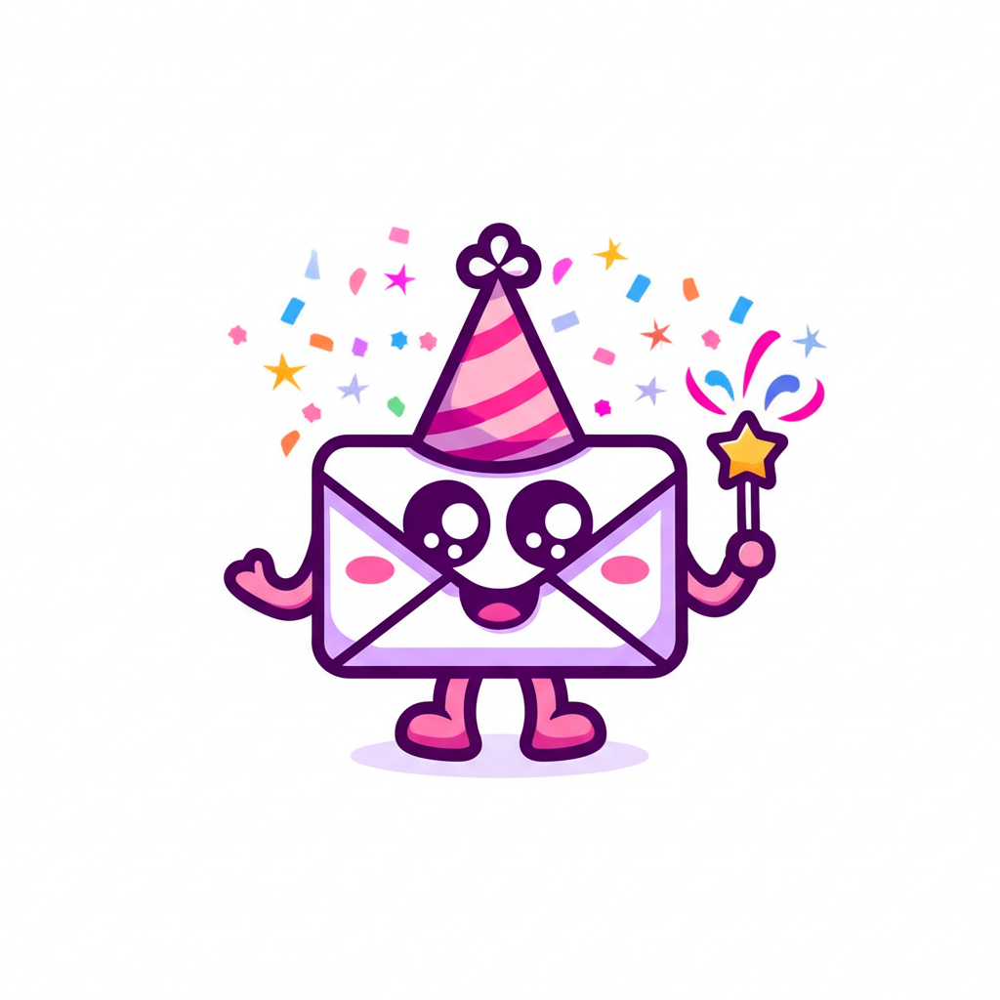
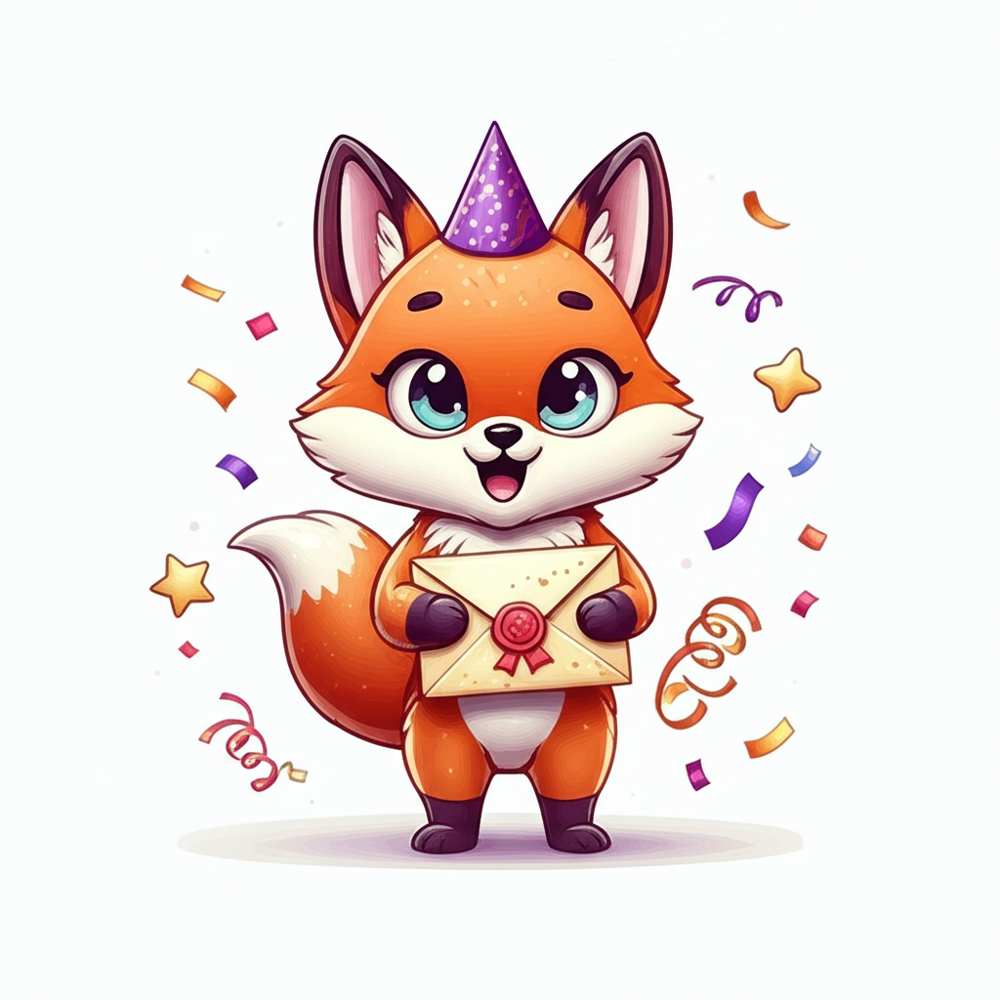
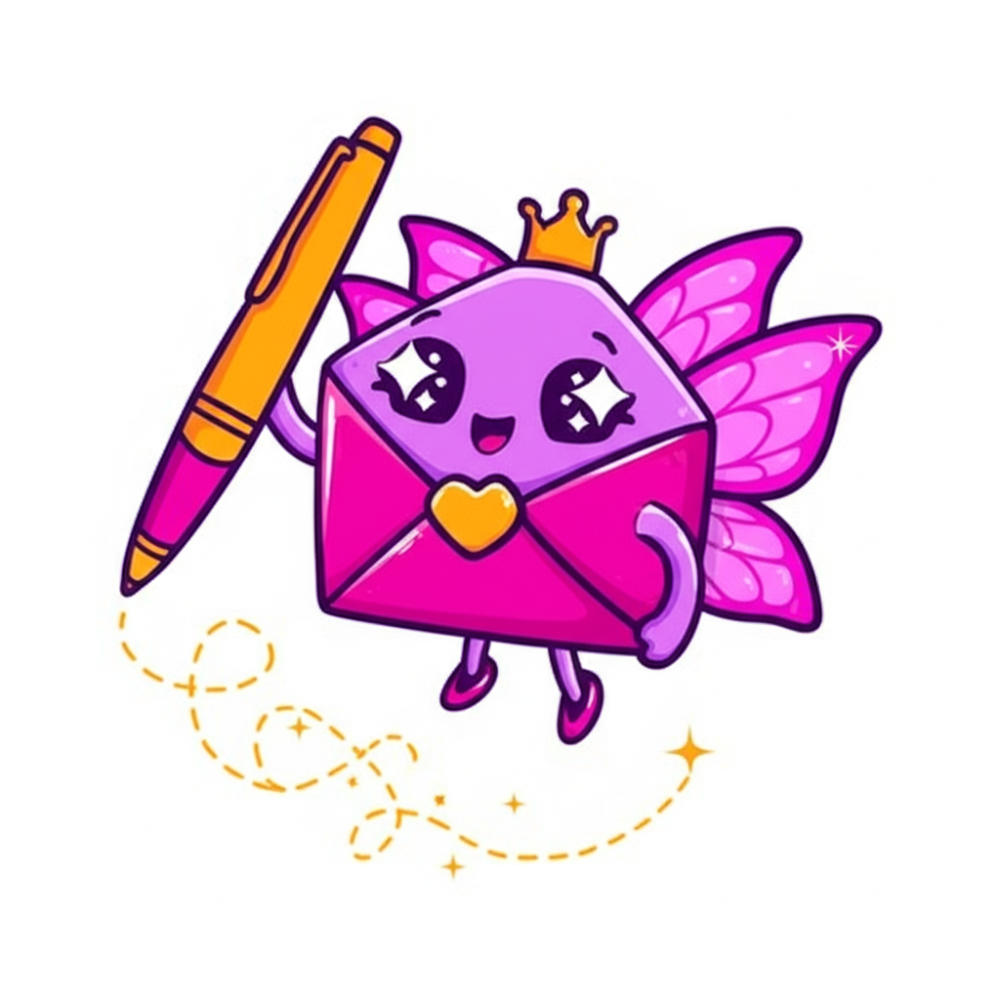

# Meet Invy: The Instavite Mascot 💌

Every great product needs a face. Duolingo has its owl. GitHub has the Octocat. Mailchimp has Freddie the chimp. Today, [Instavite](https://instavite.io) gets its own — meet **Invy**, the party envelope.

## Why a Mascot?

Brand mascots aren't just cute — they're conversion machines. Studies show mascots can increase emotional connection by up to 41% and make brands more memorable. For a product like Instavite (AI-powered party invitations for busy parents), a friendly character builds trust and adds personality to what could otherwise feel like "just another SaaS tool."

Plus, kids' party invitations should feel *fun*. A mascot sets the tone before you even type your first prompt.

## The AI Design Process

We generated three concepts using Google's Gemini image generation, each taking a different direction:

### Concept 1: The Party Envelope ✉️

A kawaii-style envelope with arms and legs, wearing a striped party hat and wielding a magic wand that shoots confetti. Purple and pink color palette matching the Instavite brand. Clean, logo-friendly, scales well at any size.

### Concept 2: The Party Fox 🦊

An adorable fox cub in a purple party hat, clutching a wax-sealed envelope. Pixar-inspired 3D render vibes. Tons of personality, but the fox doesn't inherently say "invitations."

### Concept 3: The Envelope Fairy 🧚

A flying envelope with butterfly wings, a tiny crown, and a golden pen trailing sparkles. Heart-shaped wax seal. The most magical and whimsical of the three — great brand energy.

## The Winner: Invy 🏆

We went with **Concept 1 — the Party Envelope**. Here's why:

- **Instantly recognizable** — It IS an envelope. No abstraction needed.
- **Logo-friendly** — Works as a favicon, app icon, social avatar, watermark. Clean lines at any size.
- **On-brand** — Purple/pink palette matches Instavite's existing design language.
- **Approachable** — The kawaii style appeals to our target audience (parents, especially moms planning kids' parties).
- **Versatile** — Easy to create poses, expressions, and animations from this base design.

The name "Invy" is short for "invitation" and rhymes with "envy" — as in, your friends will be *envious* of your party invites. 😏

## Animating Invy

Static mascots are nice. *Animated* mascots are unforgettable. We're planning to bring Invy to life across the Instavite experience:

- **Homepage hero** — Invy bouncing gently with sparkles from the wand
- **Loading states** — Invy doing a little dance while your invite generates
- **Empty states** — Invy looking curious when you have no events yet
- **Error pages** — Sad Invy with a torn envelope (404)
- **Onboarding** — Invy guiding new users through the creation flow
- **Email headers** — Invy delivering your invitation

For web animation, we're looking at **Lottie** (lightweight JSON animations from After Effects) or pure **CSS keyframe animations** for simpler motions like bounce, wiggle, and sparkle effects. Lottie files are tiny (~5-50KB) and render at 60fps — perfect for keeping the site fast while adding delight.

## The Bigger Picture

A mascot is more than decoration — it's a brand asset that compounds over time. Duolingo's entire marketing strategy revolves around their owl's personality on social media. The owl has become more recognizable than the app itself.

For Instavite, Invy gives us:
- A consistent visual identity across all touchpoints
- Social media content that doesn't feel like ads
- Emotional connection with parents (and their kids)
- Sticker packs, merch potential, and shareable moments

All generated in under 5 minutes with AI. The barrier to great branding has never been lower.

## Try Instavite

Want to create stunning AI-powered party invitations? Check out [instavite.io](https://instavite.io) — it's free to start. Invy will be waiting for you. ✨

---

*Built by [Adrian](https://x.com/aye_dreee_an) and [Desmond](https://x.com/DesmondAI_) 🔷*
