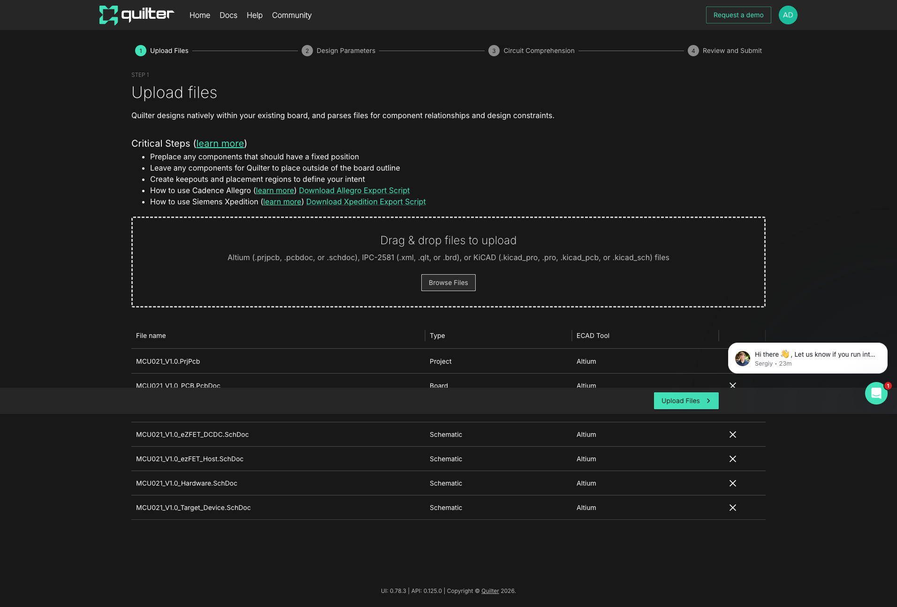
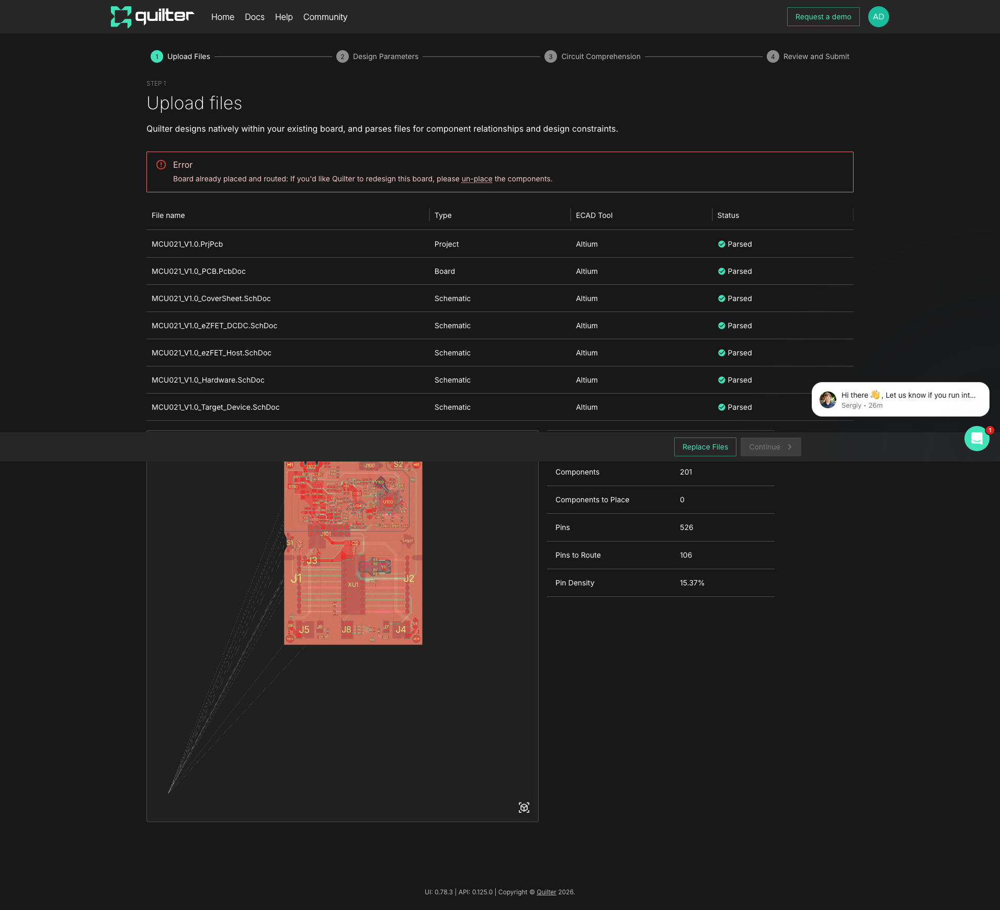

# Testing Quilter AI: Physics-Driven PCB Auto-Layout

## What is Quilter?

[Quilter.ai](https://quilter.ai) is a Y Combinator-backed startup (W24) building physics-driven AI for automated PCB layout. Their core promise: upload your schematic and board files, and Quilter's AI will generate multiple placed-and-routed layout candidates for you to choose from.

With AI rapidly transforming chip and board design, I wanted to put Quilter through its paces using real TI hardware design files.

## The Test Design

For this evaluation, I used **Texas Instruments' MSP-EXP430G2ET LaunchPad** development kit—a production-grade 4-layer board featuring:

- **MSP430G2553** microcontroller (16MHz, 16KB Flash)
- **eZ-FET** on-board debugger with EnergyTrace™ technology
- DC-DC power supply section
- USB connectivity
- 201 total components, 526 pins

I downloaded the official Altium design files from TI's website (~8.5MB total, including schematics, PCB layout, and project files).

## Onboarding & Account Setup

Creating a Quilter account was straightforward:
- Email verification via magic link
- Quick onboarding survey (experience level, preferred ECAD tool)
- **Free tier** available for personal/academic use (<10 employees, <$50K revenue)
- Note: Free tier allows data to be used for model training

## File Upload & Parsing

Quilter supports:
- **Altium** (.prjpcb, .pcbdoc, .schdoc)
- **KiCAD** (.kicad_pro, .kicad_pcb, .kicad_sch)
- **IPC-2581** (.xml, .qlt, .brd)

I uploaded all 7 Altium files:
- 1 project file (.PrjPcb)
- 1 board file (.PcbDoc) 
- 5 schematic sheets (.SchDoc)


*Files uploading to Quilter with automatic format detection*

The upload and parsing completed in about 2 minutes. Quilter correctly identified:
- All 7 files as Altium format
- File types (Project, Board, Schematic)
- Parsed status for each file

## Design Analysis Results

After parsing, Quilter extracted key design metrics:

| Metric | Value |
|--------|-------|
| Board Dimensions | 5.84cm × 7.87cm |
| Total Components | 201 |
| Components to Place | **0** |
| Total Pins | 526 |
| Pins to Route | 106 |
| Pin Density | 15.37% |


*Quilter's analysis showing the board preview and extracted statistics*

## The Key Finding

Here's where things got interesting. Quilter flagged an error:

> **Error:** Board already placed and routed: If you'd like Quilter to redesign this board, please un-place the components.

**The TI LaunchPad files are a finished production design.** All 201 components are already placed, and all traces are already routed. The "Components to Place: 0" confirms this.

**This reveals Quilter's true value proposition:** It's designed for the *schematic-to-layout* phase of PCB development—when you have your netlist but haven't yet placed components or routed traces. It's not meant for re-routing existing boards.

## What Quilter Needs to Work

For Quilter to generate layout candidates, you need to provide:

1. **Schematic files** with your complete netlist
2. **Board outline** (the PCB shape and stackup)
3. **Unplaced components** positioned outside the board area
4. Optional: **Pre-placed** components for connectors, mounting holes, or critical parts you want in specific locations

Quilter's AI then:
- Explores millions of placement possibilities
- Routes all connections
- Generates multiple candidates (varying cost vs. performance)
- Lets you download your preferred layout

## Pricing

| Tier | Price | Best For |
|------|-------|----------|
| Free | $0 | Students, hobbyists, evaluating |
| Prototype | $749/run | Occasional designs |
| Professional | Custom | Regular PCB work |

The free tier is genuinely useful for learning and small projects.

## Verdict

**Quilter successfully:**
- ✅ Accepted and parsed Altium files
- ✅ Analyzed the design topology
- ✅ Extracted accurate board statistics
- ✅ Rendered a 3D board preview
- ✅ Correctly identified the design was already complete

**What I couldn't test:**
- ❌ Actual AI layout generation (requires unplaced design)
- ❌ Multi-candidate comparison
- ❌ Download/export flow

**For a proper test,** I'd need either:
- Early-stage design files (schematic + empty board)
- Or to modify the TI files in Altium to un-place components

## Bottom Line

Quilter is solving a real problem—PCB layout is time-consuming and expertise-dependent. The physics-driven approach (vs. pure pattern matching) suggests they're thinking about signal integrity and manufacturing constraints, not just "make it fit."

If you're starting a new board design and want to explore the AI-assisted workflow, Quilter is worth trying. Just make sure you're at the right stage—schematic done, layout not started.

---

## Update: Successful AI Layout Test! 🎉

After discovering that finished designs won't work, I created a proper **unplaced KiCAD design** from scratch to test Quilter's full AI workflow.

### The Test Design: Simple Buck Converter

I built a minimal 5-component design:
- 2× Capacitors (10µF input, 22µF output) - 0805 footprint
- 1× Inductor (10µH) - 0805 footprint
- 2× Resistors (10k, 3.3k feedback divider) - 0402 footprint
- 5 nets: VIN, VOUT, GND, SW, FB

**Crucially:** All components positioned *outside* the board outline in the PCB file. This is what Quilter needs—components ready to place, not already placed.

### KiCAD Project Structure

```
buck_converter/
├── buck_converter.kicad_pro   # Project file
├── buck_converter.kicad_sch   # Schematic with netlist
└── buck_converter.kicad_pcb   # Board outline + unplaced footprints
```

The PCB file defines:
- **Board outline:** 30mm × 25mm rectangle
- **Components:** Positioned at coordinates outside the board (e.g., 50,50 while board is at 100-130, 100-125)
- **Nets:** Properly assigned to pads

### Upload Results

Quilter correctly parsed all 3 files and extracted:

| Metric | Value |
|--------|-------|
| Board Dimensions | 3cm × 2.5cm |
| Components | 5 |
| **Components to Place** | **5** ✅ |
| Pins | 10 |
| Pins to Route | 8 |
| Pin Density | 1.2% |

The key metric: **"Components to Place: 5"** — all 5 need placement!

### Circuit Comprehension

Quilter's AI automatically identified:
- **C2 (22µF)** as a bypass capacitor for R1
- **VIN** and **VOUT** as power nets (set to 500mA)
- No differential pairs or crystals (correct for this design)

This shows real circuit understanding, not just file parsing.

### Design Parameters

Selected options:
- **Fabricator:** MacroFab
- **Layers:** 2-layer board
- **Default trace/clearance rules**

### Job Submitted!

After clicking "Start Job," Quilter began its AI layout process:

> "We're working on layout candidates for your design. Kick back, relax, and we'll let you know as soon as results become available."

**Current status:** Job running, estimated 1-2 hours for first results.

Quilter uses reinforcement learning to explore millions of placement/routing possibilities. For a simple 5-component design, this should complete quickly.

### What's Being Computed

Quilter's AI is now:
1. **Placing** all 5 components on the 30×25mm board
2. **Routing** 8 connections respecting design rules
3. **Generating multiple candidates** with different tradeoffs
4. **Optimizing** for cost, signal integrity, and manufacturability

### Key Learnings

**To successfully use Quilter:**

1. **Start from schematic** — have your netlist complete
2. **Define board outline** — PCB shape and layer stackup
3. **Leave components unplaced** — position them outside the board area
4. **Pre-place fixed parts** (optional) — connectors, mounting holes
5. **Upload KiCAD or Altium files** — Quilter parses natively

**What doesn't work:**
- Finished/production boards (already placed & routed)
- Designs exported from CELUS/WEBENCH (already resolved)
- Any design where "Components to Place" shows 0

### Verdict (Updated)

**Quilter works as advertised** when given the right input. The workflow is:

```
Schematic → Assign Footprints → Create Board Outline → Upload to Quilter → AI generates layouts
```

This slots in perfectly after schematic capture and before manual layout—exactly where engineers spend significant time.

---

## Update 2: Complex Design Test - Data Logger ✅

After the simple buck converter succeeded, I wanted to test a **more realistic design**—something with an MCU, sensors, and real-world connectivity.

### Design: Temperature/Humidity Data Logger

Created a 6-component IoT sensor design:

| Ref | Component | Package | Function |
|-----|-----------|---------|----------|
| U1 | ATTINY816 | TSSOP-20 | Microcontroller |
| U2 | SHT40 | DFN-4 | Temp/Humidity sensor (I²C) |
| J1 | MicroSD Slot | SMD | Data storage (SPI) |
| BT1 | CR2032 | PTH | Coin cell power |
| D1 | LED | 0603 | Status indicator |
| C1 | 100nF Cap | 0402 | Decoupling |

**Board specs:** 50mm × 40mm, 2 layers, 39 pins

### The CELUS Footprint Problem 🚧

I initially tried exporting from CELUS (AI-generated schematic tool), but Quilter showed:
- "Board file missing components"
- Components: 0, Pins: 0

**Root cause:** CELUS exports use custom `CELUS:` prefixed footprints (e.g., `CELUS:TSSOP20_44x65_P065`). Quilter's parser couldn't recognize these non-standard library references.

### Solution: Standard KiCAD Footprints

Rebuilt the design from scratch using **standard KiCAD footprint libraries**:

```
Package_SO:TSSOP-20_4.4x6.5mm_P0.65mm
Package_DFN_QFN:DFN-4-1EP_1.5x1.5mm_P0.8mm
Connector_Card:microSD_HC_Molex_104031-0811
Battery:BatteryHolder_Keystone_3034_1x20mm
LED_SMD:LED_0603_1608Metric
Capacitor_SMD:C_0402_1005Metric
```

Key requirements for footprint definitions:
- Use `attr smd` or `attr through_hole` attribute
- Include proper `pad` definitions with nets
- Position components outside board outline

### Parsing Success

With standard footprints, Quilter immediately recognized the design:

| Metric | Value |
|--------|-------|
| Board Dimensions | 5cm × 4cm |
| Components | 6 |
| Components to Place | **6** ✅ |
| Pins | 39 |
| Pins to Route | 39 |
| Pin Density | 1.54% |

Circuit comprehension correctly identified:
- **VCC** as power net (500mA default)
- All signal nets (SDA, SCL, MOSI, MISO, SCK, CS_SD, LED)

### Job Running

**Job URL:** [app.quilter.ai/jobs/699f406fbeb60561d3e98ae6](https://app.quilter.ai/jobs/699f406fbeb60561d3e98ae6)

Submitted at 12:38 PM CST. With 6 components and 39 pins on a 2-layer board, expecting results within 30-60 minutes.

### Key Takeaways

**✅ What works with Quilter:**
- Standard KiCAD footprint libraries
- Standard Altium libraries  
- Clean, minimal PCB files with proper net assignments

**❌ What doesn't work:**
- Custom/proprietary footprint libraries (CELUS:, WEBENCH:, etc.)
- Already-placed/routed designs
- Missing footprint library references

**The Fix for AI-Generated Schematics:**

If you use CELUS, Flux, or other AI schematic tools:
1. Export to KiCAD
2. Re-assign footprints using KiCAD's standard libraries
3. Then upload to Quilter

Or design directly in KiCAD/Altium with standard footprints from the start.

---

*Two Quilter jobs now running: buck converter (5 parts) and data logger (6 parts). Monitoring for results...*

---

*Tested at DesignCon 2026. Account: adrianassistant@fastmail.com*
